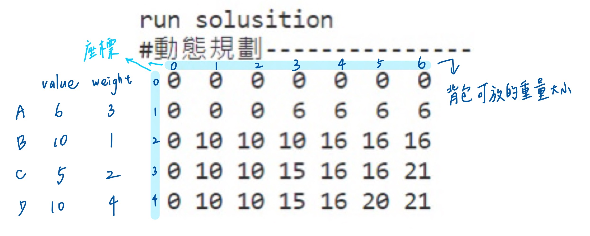

# **資料結構期末報告: Knapsack Problem**
## **組員:**
#### **通訊三 109503522 鄒穎麒**
#### **通訊二 110503502 李冠蓉**
#### **通訊二 110503504 林巧翎**

## 背包問題（Knapsack problem）
是一種組合最佳化的 NP 完全問題

* P/NP 問題：根據時間複雜度決定。簡單理解，在有限時間內能以圖靈機(Turing machine)解完的叫做 P 問題，例如:數字排序。而 NP問題則是沒有辦法在有限時間內解完的問題，例如:西洋棋的最佳解

* 問題示例：給定一組物品，每種物品都有自己的重量和價格，在限定的總重量和空間內，我們如何選擇，才能使得物品的總價格最高。背包問題通常出現在資源分配中，決策者必須分別從一組不可分割的專案或任務中進行選擇，而這些專案又有時間或預算的限制


## **操作介面架構**
主要由```mega_handler```去管理所有的任務，查詢歷史紀錄時，由```history_handler```處理，正常輸入則是透過```input_handler```去管理。
                     |mega_handler|
                     /            \
                    /              \
        |history_handler|       |input_handler|
### **操作介面管理**
|函式名稱|說明|
|--|--|
|**bool mega_handler(char input)**|處裡一個字元的任務執行|
|**void sys_handler(void)**|以迴圈的方式處裡重複的資料，重新輸入```mega_handler```|
### **歷史紀錄查找**
**在儲存、拜訪歷史紀錄的部分主要是由以下三個函示負責**
|函式名稱|說明|
|--|--|
|**void new(BACKPACK\* backptr)**|將輸入完成的背包問題儲存入雙向的link list上|
|**void hptr_up(void)**|往上查找歷史紀錄|
|**void hptr_down(void)**|往下查找歷史紀錄|
## 動態規劃


#### 舉例說明

第一行 0 代表背包最大承受重量為零的時候，背包中物品的總價值為零

第一列 0 代表將一個價值且重量皆為0的物品，添加到背包中以後，背包中物品的總價值為 0

(1,1)：第一個物品的價值為 6 、重量為 3 ，重量為 3 的物品無法放到重量限制為 1 的背包中， 3 > 1 ，所以把同一行、上一列的 0 複製下來，這個 0 表示該物品未放入背包以前，背包的最優解是 0

(1,3)：重量為 3 的物品，可以放入重量限制為 3 的背包中 ，取 MAX{ (0,3) , 6+(0,0) } 填入 (1,3) ， (0,3) 表示背包重量為3時，尚未放入物品 A 時的最佳解， 6+(0,0) 表示放入物品 A 後背包剩餘重量為 0 ，對照背包限制重量為0時的最佳解。

(4,2)：重量為 1 的物品，可以放入重量限制為 4 的背包中 ，取 MAX{ (1,4) , 10+(1,3) } 填入 (4,2) ， (1,4) 表示背包重量為4時，尚未放入物品 B 時的最佳解， 10+(1,3) 表示放入物品 B 後背包剩餘重量為 3 ，對照背包限制重量為 4-1 = 3 時的最佳解。

剩下的部分則以此類推，最後表格右下角所得的數值為背包最大限重下，可以放入的最大價值
